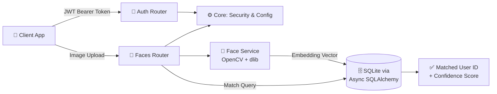
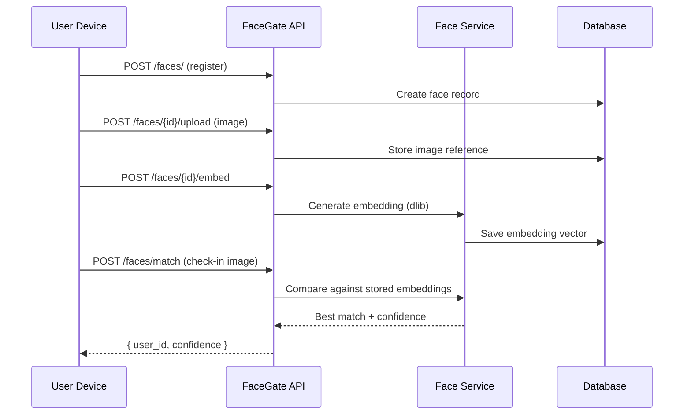

<div align="center">


<br/>

[](https://fastapi.tiangolo.com/)
[](https://www.python.org/)
[](https://www.sqlalchemy.org/)
[](https://opencv.org/)
[](https://github.com/ageitgey/face_recognition)

[](#-license)
[](#-roadmap)
[](#-contributing)
[](https://github.com/Crusty-chirayu/Face-Recognition/stargazers)

</div>

---

## 🪪 Overview

**FaceGate** is a FastAPI-powered backend system that combines secure authentication, facial recognition, and automated attendance tracking into a single cohesive API. Built for organizations that need reliable identity verification without the complexity — or the vendor lock-in — of third-party SaaS solutions.

No black-box biometric platform, no per-seat licensing. Just a self-hosted API you fully control: register a face, generate its embedding, and match it against your own database in milliseconds.

<br/>

## 📚 Table of Contents

- [Features](#-features)
- [Tech Stack](#-tech-stack)
- [Architecture](#-architecture)
- [Getting Started](#-getting-started)
- [Default Admin Credentials](#-default-admin-credentials)
- [API Reference](#-api-reference)
- [Recognition Workflow](#-recognition-workflow)
- [Project Structure](#-project-structure)
- [Security Notes](#-security-notes)
- [Roadmap](#-roadmap)
- [Contributing](#-contributing)
- [License](#-license)
- [Author](#-author)

<br/>

## ✨ Features

| Feature | Description |
|---|---|
| 🔐 JWT Authentication | Secure token-based auth with role management |
| 👤 User Management | Full CRUD for user profiles and accounts |
| 🧠 Face Recognition | Embedding-based facial matching via `face_recognition` |
| 📸 Image Upload | Profile image ingestion and preprocessing |
| 📊 Attendance Tracking | Automated check-in/check-out via face match |

<br/>

## 🧰 Tech Stack

<div align="center">

| Layer | Technology |
|---|---|
| **Framework** | FastAPI |
| **Language** | Python 3.11 |
| **ORM** | SQLAlchemy (Async) |
| **Database** | SQLite |
| **Vision / ML** | OpenCV + `face-recognition` (dlib) |
| **Auth** | JWT (JSON Web Tokens) |

</div>

<br/>

## 🏗️ Architecture





<br/>

## 🚀 Getting Started

### Prerequisites

- Python 3.11+
- `pip`
- `cmake` (required by `dlib` for `face-recognition`)

### Installation

```bash
# 1. Clone the repository
git clone https://github.com/Crusty-chirayu/Face-Recognition.git
cd Face-Recognition/facegate/backend

# 2. Create and activate a virtual environment
python3.11 -m venv venv311
source venv311/bin/activate         # bash/zsh
# source venv311/bin/activate.fish  # fish shell

# 3. Install dependencies
pip install -r requirements.txt

# 4. Start the development server
python -m uvicorn app.main:app --reload
```

<div align="center">

| Resource | URL |
|---|---|
| 🌐 API Base | `http://localhost:8000` |
| 📖 Interactive Docs (Swagger) | `http://localhost:8000/docs` |

</div>

<br/>

## 🔑 Default Admin Credentials

```
Email:    admin@gmail.com
Password: AdminPass123!
```

> ⚠️ **Change these credentials immediately** in any non-development environment. Shipping default credentials to production is a critical security risk.

<br/>

## 🔌 API Reference

### Authentication

| Method | Endpoint | Description |
|---|---|---|
| `POST` | `/auth/login` | Obtain a JWT access token |
| `GET` | `/auth/me` | Retrieve the authenticated user's profile |

### Face Management

| Method | Endpoint | Description |
|---|---|---|
| `POST` | `/faces/` | Register a new face entry |
| `POST` | `/faces/{id}/upload` | Upload an image for a registered face |
| `POST` | `/faces/{id}/embed` | Generate a face embedding from the uploaded image |
| `POST` | `/faces/match` | Match an incoming image against stored embeddings |

<br/>

## 🔄 Recognition Workflow

```
1. Register face      →  POST /faces/
2. Upload image        →  POST /faces/{id}/upload
3. Generate embedding   →  POST /faces/{id}/embed
4. Match face           →  POST /faces/match
```

For attendance use cases, run **step 4** at check-in/check-out time. The system returns the matched user's ID and a confidence score.

<br/>

## 📁 Project Structure

```
facegate/
└── backend/
    ├── app/
    │   ├── main.py          # FastAPI app entry point
    │   ├── models/          # SQLAlchemy ORM models
    │   ├── routers/         # Route handlers (auth, faces)
    │   ├── schemas/         # Pydantic request/response schemas
    │   ├── services/        # Business logic (face matching, embedding)
    │   └── core/             # Config, security, database session
    ├── requirements.txt
    └── README.md
```

<br/>

## 🛡️ Security Notes

- 🔐 All protected routes require a valid **JWT bearer token** obtained via `/auth/login`.
- 🧠 Face embeddings — not raw images — are what's used for matching, reducing exposure of biometric data at rest.
- ⚠️ Rotate the default admin credentials before any deployment outside local development.
- 🗄️ SQLite is suited for development and small deployments; see the [Roadmap](#-roadmap) for planned PostgreSQL support ahead of production use.

<br/>

## 🗺️ Roadmap

- [ ] PostgreSQL support
- [ ] Multi-face detection per image
- [ ] Attendance report export (CSV / PDF)
- [ ] Docker + Docker Compose setup
- [ ] WebSocket real-time attendance feed

<br/>

## 🤝 Contributing

Pull requests are welcome. For major changes, please open an issue first to discuss what you'd like to change.

1. Fork the repository
2. Create your feature branch (`git checkout -b feature/your-feature`)
3. Commit your changes (`git commit -m 'Add your feature'`)
4. Push to the branch (`git push origin feature/your-feature`)
5. Open a Pull Request

<br/>

## 📄 License

This project is open source. See [LICENSE](LICENSE) for details.

<br/>

## 👤 Author

<div align="center">

### Chirayu

[](https://github.com/Crusty-chirayu)

</div>

<br/>

<div align="center">

### 🔍 If FaceGate helped you skip the SaaS bill, drop it a ⭐


</div>
