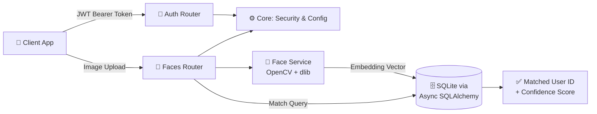
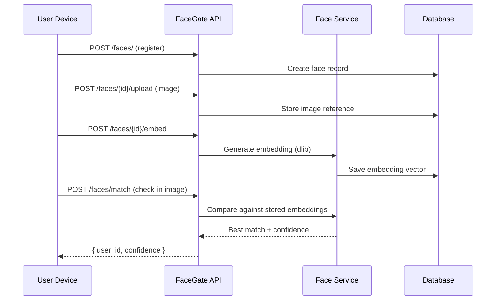
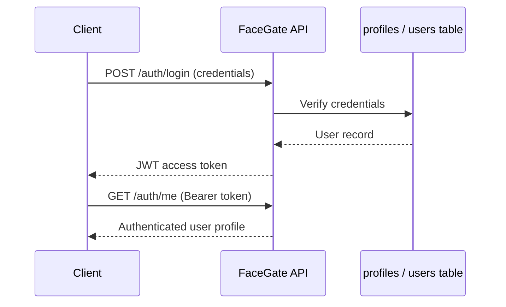

<div align="center">


<br/>

[](https://fastapi.tiangolo.com/)
[](https://www.python.org/)
[](https://www.sqlalchemy.org/)
[](https://alembic.sqlalchemy.org/)
[](https://opencv.org/)
[](https://github.com/ageitgey/face_recognition)
[](https://www.docker.com/)

[](#-license)
[](#-roadmap)
[](#-contributing)
[](https://github.com/Crusty-chirayu/Face-Recognition/stargazers)
[](https://github.com/Crusty-chirayu/Face-Recognition/commits/main)
[](https://github.com/Crusty-chirayu/Face-Recognition/issues)

</div>

---

## 🪪 Overview

**FaceGate** is a FastAPI-powered backend system that combines secure authentication, facial recognition, and automated attendance tracking into a single cohesive API. Built for organizations that need reliable identity verification without the complexity — or the vendor lock-in — of third-party SaaS solutions.

No black-box biometric platform, no per-seat licensing. Just a self-hosted API you fully control: register a face, generate its embedding, and match it against your own database in milliseconds.

<br/>

## 📚 Table of Contents

- [Why FaceGate?](#-why-facegate)
- [Status Snapshot](#-status-snapshot)
- [Features](#-features)
- [Tech Stack](#-tech-stack)
- [Architecture](#-architecture)
- [Getting Started](#-getting-started)
- [Docker](#-docker)
- [Default Admin Credentials](#-default-admin-credentials)
- [API Reference](#-api-reference)
- [Recognition Workflow](#-recognition-workflow)
- [Project Structure](#-project-structure)
- [Security Notes](#-security-notes)
- [Roadmap](#-roadmap)
- [FAQ](#-faq)
- [Contributing](#-contributing)
- [License](#-license)
- [Author](#-author)

<br/>

## 🎯 Why FaceGate?

Off-the-shelf attendance/identity SaaS tends to come with three costs that don't show up on the pricing page: your biometric data lives on someone else's infrastructure, per-seat pricing scales against you as headcount grows, and you're stuck waiting on their roadmap for any customization.

FaceGate flips that: it's a self-hosted FastAPI service you own end-to-end. Faces are stored as **embeddings, not raw images**, matching happens against your own database, and the entire pipeline — registration, upload, embedding, matching — is four inspectable API calls, not a black box.

<br/>

## 📊 Status Snapshot

> Reflects what's actually in the repository (`alembic/`, `app/`, `scripts/`, `static/`, `Dockerfile`) rather than aspirational scope.

<div align="center">

| Area | State |
|---|:---:|
| 🔐 Auth (JWT login + profile) | ✅ Shipped |
| 🧠 Face registration → upload → embed → match pipeline | ✅ Shipped |
| 🗄️ DB migrations | ✅ Alembic configured (`alembic/`, `alembic.ini`) |
| 🐳 Containerization | ⚠️ `Dockerfile` present — `docker-compose.yml` still open, see [Roadmap](#-roadmap) |
| 🐘 PostgreSQL | 🚧 Planned — currently SQLite |
| 👥 Multi-face-per-image detection | 🚧 Planned |
| 📤 Attendance export (CSV/PDF) | 🚧 Planned |

</div>

<br/>

## ✨ Features

| Feature | Description |
|---|---|
| 🔐 JWT Authentication | Secure token-based auth with role management |
| 👤 User Management | Full CRUD for user profiles and accounts |
| 🧠 Face Recognition | Embedding-based facial matching via `face_recognition` |
| 📸 Image Upload | Profile image ingestion and preprocessing |
| 📊 Attendance Tracking | Automated check-in/check-out via face match |
| 🗄️ Schema Migrations | Alembic-managed database migrations |

<br/>

## 🧰 Tech Stack

<div align="center">

| Layer | Technology |
|---|---|
| **Framework** | FastAPI |
| **Language** | Python 3.11 |
| **ORM** | SQLAlchemy (Async) |
| **Migrations** | Alembic |
| **Database** | SQLite |
| **Vision / ML** | OpenCV + `face-recognition` (dlib) |
| **Auth** | JWT (JSON Web Tokens) |
| **Containerization** | Docker |

</div>

<br/>

## 🏗️ Architecture



### Registration → Match Pipeline



### Authentication Flow



<sub>Standard JWT bearer pattern this API follows, illustrated generically — confirm exact request/response bodies against `app/routers/auth.py` and `app/schemas/`.</sub>

<br/>

## 🚀 Getting Started

### Prerequisites

- Python 3.11+
- `pip`
- `cmake` (required by `dlib` for `face-recognition`)

### Installation

```bash
# 1. Clone the repository
git clone https://github.com/Crusty-chirayu/Face-Recognition.git
cd Face-Recognition/facegate/backend

# 2. Create and activate a virtual environment
python3.11 -m venv venv311
source venv311/bin/activate         # bash/zsh
# source venv311/bin/activate.fish  # fish shell

# 3. Install dependencies
pip install -r requirements.txt

# 4. Configure environment
cp .env.example .env
# fill in secret key, DB URL, and any other values .env.example expects

# 5. Apply database migrations
alembic upgrade head

# 6. Start the development server
python -m uvicorn app.main:app --reload
```

<div align="center">

| Resource | URL |
|---|---|
| 🌐 API Base | `http://localhost:8000` |
| 📖 Interactive Docs (Swagger) | `http://localhost:8000/docs` |

</div>

<br/>

## 🐳 Docker

A `Dockerfile` ships with the repo — build and run the API in a container without setting up a local Python environment:

```bash
docker build -t facegate .
docker run -p 8000:8000 --env-file .env facegate
```

<sub>💡 A `docker-compose.yml` (API + database in one command) is still on the [Roadmap](#-roadmap) — the Dockerfile itself already works standalone today.</sub>

<br/>

## 🔑 Default Admin Credentials

```
Email:    admin@gmail.com
Password: AdminPass123!
```

> ⚠️ **Change these credentials immediately** in any non-development environment. Shipping default credentials to production is a critical security risk.

<br/>

## 🔌 API Reference

### Authentication

| Method | Endpoint | Description |
|---|---|---|
| `POST` | `/auth/login` | Obtain a JWT access token |
| `GET` | `/auth/me` | Retrieve the authenticated user's profile |

### Face Management

| Method | Endpoint | Description |
|---|---|---|
| `POST` | `/faces/` | Register a new face entry |
| `POST` | `/faces/{id}/upload` | Upload an image for a registered face |
| `POST` | `/faces/{id}/embed` | Generate a face embedding from the uploaded image |
| `POST` | `/faces/match` | Match an incoming image against stored embeddings |

### Try it with `curl`

<sub>Illustrative shape of the calls — confirm exact field/param names against `app/schemas/` before relying on these verbatim.</sub>

```bash
# 1. Log in and grab a token
TOKEN=$(curl -s -X POST http://localhost:8000/auth/login \
  -d "username=admin@gmail.com&password=AdminPass123!" \
  -H "Content-Type: application/x-www-form-urlencoded" | jq -r .access_token)

# 2. Register a face entry
curl -X POST http://localhost:8000/faces/ \
  -H "Authorization: Bearer $TOKEN"

# 3. Upload an image for that face
curl -X POST "http://localhost:8000/faces/{id}/upload" \
  -H "Authorization: Bearer $TOKEN" \
  -F "file=@./photo.jpg"

# 4. Generate its embedding
curl -X POST "http://localhost:8000/faces/{id}/embed" \
  -H "Authorization: Bearer $TOKEN"

# 5. Match a new image against stored embeddings
curl -X POST http://localhost:8000/faces/match \
  -H "Authorization: Bearer $TOKEN" \
  -F "file=@./checkin.jpg"
```

<br/>

## 🔄 Recognition Workflow

```
1. Register face      →  POST /faces/
2. Upload image        →  POST /faces/{id}/upload
3. Generate embedding   →  POST /faces/{id}/embed
4. Match face           →  POST /faces/match
```

For attendance use cases, run **step 4** at check-in/check-out time. The system returns the matched user's ID and a confidence score.

<sub>`TODO`: document the confidence/similarity threshold used to decide a match vs. no-match, once confirmed against `app/services/`.</sub>

<br/>

## 📁 Project Structure

```
Face-Recognition/
├── alembic/               # Database migration scripts
├── app/
│   ├── main.py            # FastAPI app entry point
│   ├── models/             # SQLAlchemy ORM models
│   ├── routers/             # Route handlers (auth, faces)
│   ├── schemas/             # Pydantic request/response schemas
│   ├── services/             # Business logic (face matching, embedding)
│   └── core/                  # Config, security, database session
├── scripts/                # Utility / setup scripts
├── static/                 # Static assets
├── alembic.ini
├── requirements.txt
├── Dockerfile
├── .env.example
└── README.md
```

<sub>Note: `app/` currently sits at repo root; the earlier install path referencing `facegate/backend/` reflects the repo's history — confirm the current path matches before scripting around it.</sub>

<br/>

## 🛡️ Security Notes

- 🔐 All protected routes require a valid **JWT bearer token** obtained via `/auth/login`.
- 🧠 Face embeddings — not raw images — are what's used for matching, reducing exposure of biometric data at rest.
- ⚠️ Rotate the default admin credentials before any deployment outside local development.
- 🗄️ SQLite is suited for development and small deployments; see the [Roadmap](#-roadmap) for planned PostgreSQL support ahead of production use.
- 📄 `.env.example` is provided — never commit a real `.env` with production secrets.

<br/>

## 🗺️ Roadmap

- [ ] PostgreSQL support
- [ ] Multi-face detection per image
- [ ] Attendance report export (CSV / PDF)
- [ ] `docker-compose.yml` for one-command API + DB startup *(the `Dockerfile` itself already exists — this closes the remaining gap)*
- [ ] WebSocket real-time attendance feed
- [ ] Documented confidence/similarity threshold for match decisions
- [ ] Rate limiting on `/faces/match` to slow brute-force attempts

<br/>

## ❓ FAQ

**Does FaceGate store my photos?**
Uploaded images are used to generate an embedding; the embedding vector — not the raw image — is what's used for ongoing matching, per [Security Notes](#-security-notes). Whether raw images are retained after embedding or discarded is a `TODO` to confirm against `app/services/`.

**Can this run without Docker?**
Yes — the [Getting Started](#-getting-started) path runs directly with a Python virtual environment; Docker is optional, not required.

**Is this ready for production attendance tracking?**
Rotate the default admin credentials first, and treat SQLite as a development/small-deployment database — PostgreSQL support is still on the roadmap for anything larger.

**How is a "match" decided — exact match or similarity threshold?**
`face_recognition`/dlib compares embeddings by distance, but the exact threshold FaceGate uses isn't documented yet — see the note under [Recognition Workflow](#-recognition-workflow).

<br/>

## 🤝 Contributing

Pull requests are welcome. For major changes, please open an issue first to discuss what you'd like to change.

1. Fork the repository
2. Create your feature branch (`git checkout -b feature/your-feature`)
3. Commit your changes (`git commit -m 'Add your feature'`)
4. Push to the branch (`git push origin feature/your-feature`)
5. Open a Pull Request

<br/>

## 📄 License

This project is open source. See [LICENSE](LICENSE) for details.

<br/>

## 👤 Author

<div align="center">

### Chirayu

[](https://github.com/Crusty-chirayu)

</div>

<br/>

<div align="center">

### ⭐ Star History

<a href="https://star-history.com/#Crusty-chirayu/Face-Recognition&Date">
  
</a>

</div>

<br/>

<div align="center">

### 🔍 If FaceGate helped you skip the SaaS bill, drop it a ⭐


</div>
